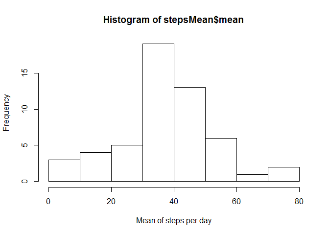
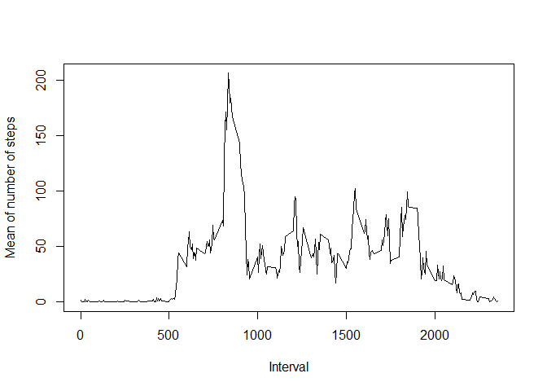
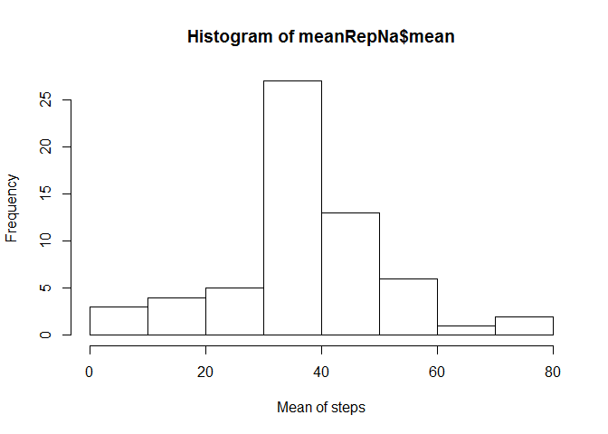
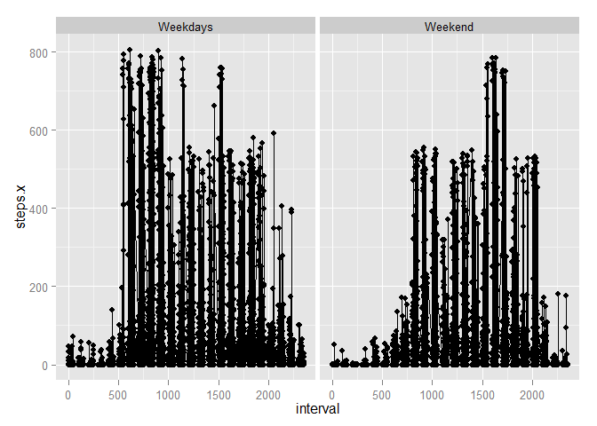

# Reproducible Research: Peer Assessment 1

We download the file from the URL https://d396qusza40orc.cloudfront.net/repdata%2Fdata%2Factivity.zip in order to get the same data. This data contains the information of movement activity from several devices like Fitbit, Nike FuelBand, Jawbone up. Our study is about the movement of people wearing these devices.

As we'll try to avoid bias in our analysis, we are going to exclude the missing values.

## Loading and preprocessing the data


```r
if (!file.exists("activity.csv")) {
  if (!file.exists("activity.zip")){
    fileUrl <- "https://d396qusza40orc.cloudfront.net/repdata%2Fdata%2Factivity.zip"
    download.file(url=fileUrl, destfile="activity.zip")
  }
  
  unzip("activity.zip") 
  #Removing compressed file
  unlink("activity.zip")  
  DateDownloaded <- date()
  print(paste("File downloaded from ", fileUrl, " on ", DateDownloaded))
  
}

activity<-read.csv("activity.csv")
#activity removing na's (actrmna)
actrmna<-activity[!is.na(activity$steps),]

#we add the mean per date
stepsMean<-aggregate(actrmna$steps,list(actrmna$date),mean)
names(stepsMean)<-c("date","mean")
```


## What is mean total number of steps taken per day?


```r
hist(stepsMean$mean, xlab="Mean of steps per day")
```

 

The mean and median are given below, along with the summary:


```r
summary(actrmna$steps)
```

```
##    Min. 1st Qu.  Median    Mean 3rd Qu.    Max. 
##     0.0     0.0     0.0    37.4    12.0   806.0
```

## What is the average daily activity pattern?


```r
#as we did with the date, we add the mean per interval
intervalMean<-aggregate(steps ~ interval, actrmna,mean)
plot(intervalMean$interval,intervalMean$steps, type="l", xlab="Interval", ylab="Mean of number of steps")
```

 


The maximum number of steps is in the following interval, with the indicated mean of steps


```r
intervalMean[(intervalMean$steps==max(intervalMean$steps)),]
```

```
##     interval steps
## 104      835 206.2
```


## Imputing missing values

Total number of missing values:

```r
dim(activity[is.na(activity),])[1]
```

```
## [1] 2304
```


We are going to replace missing values with the mean for that interval. The shape of the histogram must not have major changes adding them.


```r
actReplaceNa<-merge(activity,intervalMean, by="interval")
indices<-which(is.na(actReplaceNa$steps.x))

actReplaceNa$steps.x[indices]<-actReplaceNa$steps.y[indices]

meanRepNa<-aggregate(actReplaceNa$steps.x,list(actReplaceNa$date),mean)
names(meanRepNa)<-c("date","mean")
hist(meanRepNa$mean, xlab="Mean of steps")
```

 

Mean and median stay the same:


```r
summary(actReplaceNa$steps.x)
```

```
##    Min. 1st Qu.  Median    Mean 3rd Qu.    Max. 
##     0.0     0.0     0.0    37.4    27.0   806.0
```


## Are there differences in activity patterns between weekdays and weekends?


```
## Warning: package 'ggplot2' was built under R version 3.1.1
```


We compare the behavior of movement in weekends and weekdays.


```r
wd<-weekdays(as.Date(actReplaceNa$date))
weekend<-which(wd=="Saturday" | wd=="Sunday")

actReplaceNa$day.type<-"Weekdays"
actReplaceNa$day.type[weekend]<-"Weekend"

g<-ggplot(actReplaceNa, aes(interval,steps.x), ylab="steps")
g+geom_point()+facet_grid(. ~ day.type)+
  geom_line(method="lm")
```

 

